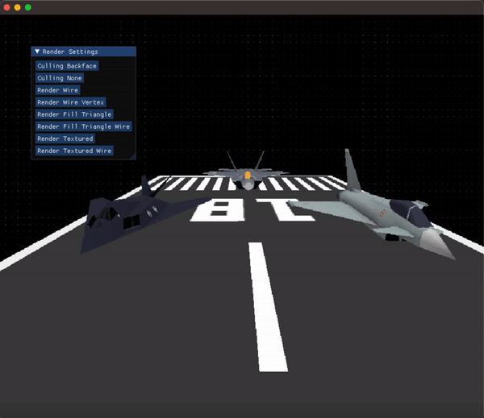
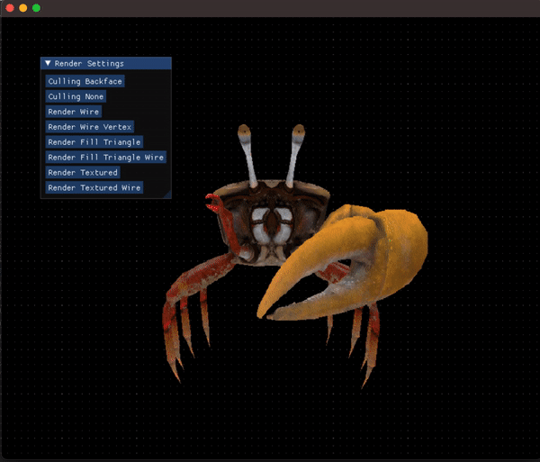

# 3D Renderer
A CPU-based 3D Render Engine

### Prerequisites
+ [CMake](http://www.cmake.org "CMake project page") (>= 3.23)
+ [SDL2](https://www.libsdl.org "Simple DirectMedia Layer") (>= 2.24.1)

### Credits
The project is based on [3D Computer Graphics Programming](https://pikuma.com/courses/learn-3d-computer-graphics-programming "3D Graphics Engine") on [pikuma.com](https://pikuma.com)
